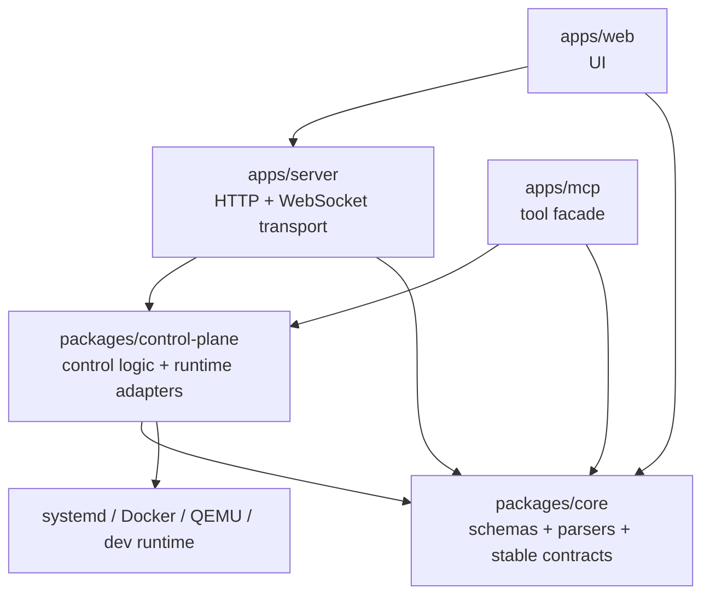
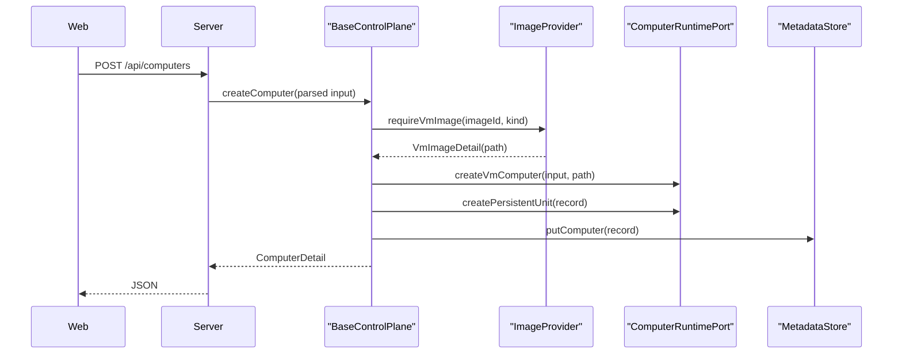
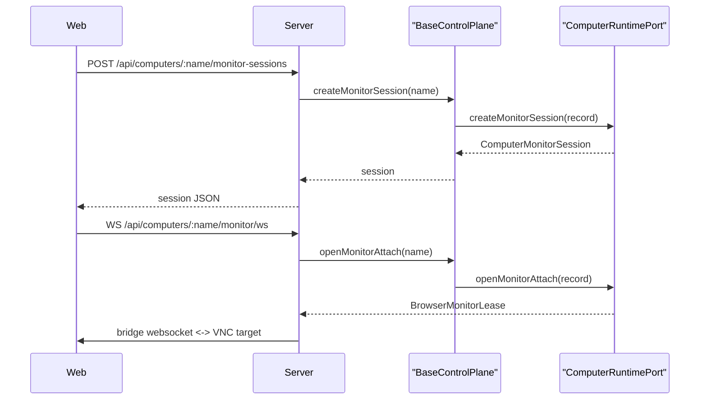

# Computerd Architecture

本文档描述当前 `computerd` 的整体技术架构，重点说明：

- 分层结构
- 顶层领域模型
- 抽象类、接口与它们之间的关系
- 每个抽象类的具体实现
- 一次请求如何穿过各层

本文档是“代码导向”的架构说明。更偏产品语义的说明见：

- [product-positioning.md](/Users/timzhong/computerd/docs/product-positioning.md)
- [computer-profiles.md](/Users/timzhong/computerd/docs/computer-profiles.md)
- [browser-computer.md](/Users/timzhong/computerd/docs/browser-computer.md)
- [vm-computer.md](/Users/timzhong/computerd/docs/vm-computer.md)
- [image-management.md](/Users/timzhong/computerd/docs/image-management.md)

## Overview

`computerd` 当前由 5 层组成：

1. `packages/core`
   定义稳定的领域 contract、schema、解析函数和对外数据形状。
2. `packages/control-plane`
   定义抽象控制面，以及 systemd/docker/development 三类运行时实现。
3. `apps/server`
   暴露 HTTP API 和 WebSocket attach surface，并负责少量宿主初始化。
4. `apps/web`
   提供 Web UI，调用 server 暴露的 API。
5. `apps/mcp`
   提供 MCP tool surface，把 control-plane 能力映射给 agent/tooling。

最重要的设计原则有两条：

- `core` 只定义 contract，不接触具体运行时。
- `control-plane` 负责把统一 computer/image 模型映射到 systemd、docker、QEMU 等具体 substrate。

## Primary Domain Objects

当前有两个顶层对象：

1. `computer`
   受管的长期运行实体。当前 profile 包括：
   - `host`
   - `browser`
   - `container`
   - `vm`

2. `image`
   可被 computer 引用的镜像工件。当前 provider 包括：
   - `filesystem-vm`
   - `docker`

这两个对象的对外 contract 都定义在 [packages/core/src/index.ts](/Users/timzhong/computerd/packages/core/src/index.ts)。

## Layering

## Core Contracts

`core` 不是抽象类层，而是 schema 和 parse 层。它主要负责三件事：

1. 定义输入 contract
   例如：
   - `CreateComputerInput`
   - `CreateVmComputerInput`
   - `ImportVmImageInput`

2. 定义输出 contract
   例如：
   - `ComputerSummary`
   - `ComputerDetail`
   - `ImageSummary`
   - `ImageDetail`
   - session objects

3. 提供 parse 函数
   例如：
   - `parseCreateComputerInput`
   - `parseComputerDetail`
   - `parseImageSummaries`

关键点：

- `core` 不知道 systemd、docker、dbus、qemu。
- `core` 只定义“什么是合法数据”，不决定“怎样实现”。

## Control Plane Abstractions

这一层是当前项目的中心。核心抽象定义散落在：

- [packages/control-plane/src/base-control-plane.ts](/Users/timzhong/computerd/packages/control-plane/src/base-control-plane.ts)
- [packages/control-plane/src/shared.ts](/Users/timzhong/computerd/packages/control-plane/src/shared.ts)
- [packages/control-plane/src/systemd/types.ts](/Users/timzhong/computerd/packages/control-plane/src/systemd/types.ts)
- [packages/control-plane/src/images.ts](/Users/timzhong/computerd/packages/control-plane/src/images.ts)

### `BaseControlPlane`

定义位置：
[packages/control-plane/src/base-control-plane.ts](/Users/timzhong/computerd/packages/control-plane/src/base-control-plane.ts)

这是控制面的抽象基类，也是当前最重要的 orchestration 类。

职责：

- 暴露统一的 public API
  - `listComputers`
  - `getComputer`
  - `createComputer`
  - `startComputer`
  - `stopComputer`
  - `restartComputer`
  - `deleteComputer`
  - `createMonitorSession`
  - `createConsoleSession`
  - `createExecSession`
  - `createAutomationSession`
  - `createScreenshot`
  - VM snapshot / restore
- 执行 profile 无关的规则
  - 名称冲突检查
  - broken 状态检查
  - capability 门禁
  - metadata 与 runtime 协调
- 调用 runtime/image/metadata 等底层抽象，而不直接接触 systemd/docker API

`BaseControlPlane` 不直接知道：

- 如何创建 systemd unit
- 如何创建 Docker container
- 如何列举 images

它把这些细节委托给下述抽象：

- `ComputerRuntimePort`
- `ComputerMetadataStore`
- `ImageProvider`

### `ComputerRuntimePort`

定义位置：
[packages/control-plane/src/systemd/types.ts](/Users/timzhong/computerd/packages/control-plane/src/systemd/types.ts)

这是运行时适配层的主抽象。它不是某一种 runtime，而是统一的运行时端口。

职责：

- 创建 runtime-specific persisted payload
  - `createContainerComputer(...)`
  - `createVmComputer(...)`
- 管理生命周期
  - `createPersistentUnit`
  - `startUnit`
  - `stopUnit`
  - `restartUnit`
  - container start/stop/restart
- 管理 attach/sessions
  - monitor
  - automation
  - screenshot
  - audio
- 管理 runtime preparation
  - browser runtime prepare
  - vm runtime prepare
- 管理 VM snapshot/restore
- 查询 runtime state

当前 concrete implementations：

1. `DefaultSystemdRuntime`
   定义位置：
   [packages/control-plane/src/systemd/runtime.ts](/Users/timzhong/computerd/packages/control-plane/src/systemd/runtime.ts)

   职责：
   - 处理 host/vm 这两类 systemd-backed runtime
   - 通过 dbus + unit file store 操作 systemd
   - 管理 vm runtime 目录
   - 创建 VM monitor attach lease
   - 管理 VM snapshot 与 cloud-init

2. `DefaultDockerRuntime`
   定义位置：
   [packages/control-plane/src/docker/runtime.ts](/Users/timzhong/computerd/packages/control-plane/src/docker/runtime.ts)

   职责：
   - 处理 `container` 与 container-backed `browser` profile
   - 通过 `dockerode` 创建、启动、停止、删除容器
   - 管理 browser/container runtime state
   - 处理 container auto-pull
   - 暴露 browser monitor / automation / screenshot attach

3. `DevelopmentComputerRuntime`
   定义位置：
   [packages/control-plane/src/development-computer-runtime.ts](/Users/timzhong/computerd/packages/control-plane/src/development-computer-runtime.ts)

   职责：
   - 提供不依赖真实 systemd/docker/qemu 的开发态 runtime
   - 用内存状态和临时文件模拟 lifecycle / session / VM snapshot
   - 支撑本地开发模式和多数单元测试

4. `CompositeComputerRuntime`
   定义位置：
   [packages/control-plane/src/composite-computer-runtime.ts](/Users/timzhong/computerd/packages/control-plane/src/composite-computer-runtime.ts)

   职责：
   - 把 `DefaultSystemdRuntime` 和 `DefaultDockerRuntime` 组合成一个统一的 `ComputerRuntimePort`
   - 对 systemd-backed profile 转发到 `systemdRuntime`
   - 对 container-backed profile 转发到 `dockerRuntime`

它的存在意义是：

- `BaseControlPlane` 只依赖一个 runtime port
- 具体 profile 的 backend 分流放到组合层，而不是散落到 control-plane public API 中

### `ComputerMetadataStore`

定义位置：
[packages/control-plane/src/systemd/types.ts](/Users/timzhong/computerd/packages/control-plane/src/systemd/types.ts)

这是 metadata persistence 的抽象。

职责：

- `getComputer`
- `listComputers`
- `putComputer`
- `deleteComputer`

当前 concrete implementations：

1. `FileComputerMetadataStore`
   定义位置：
   [packages/control-plane/src/systemd/metadata-store.ts](/Users/timzhong/computerd/packages/control-plane/src/systemd/metadata-store.ts)

   职责：
   - 使用文件系统保存 persisted computer records
   - 是 production/systemd 控制面的默认实现

2. `DevelopmentComputerMetadataStore`
   定义位置：
   [packages/control-plane/src/systemd/metadata-store.ts](/Users/timzhong/computerd/packages/control-plane/src/systemd/metadata-store.ts)

   职责：
   - 用内存 map 保存 development mode records

### `ImageProvider`

定义位置：
[packages/control-plane/src/images.ts](/Users/timzhong/computerd/packages/control-plane/src/images.ts)

这是 image inventory 和 mutation 的抽象。

职责：

- `listImages`
- `getImage`
- `requireVmImage`
- `importVmImage`
- `deleteVmImage`
- `pullContainerImage`
- `deleteContainerImage`

当前 concrete implementations：

1. `SystemImageProvider`
   定义位置：
   [packages/control-plane/src/images.ts](/Users/timzhong/computerd/packages/control-plane/src/images.ts)

   职责：
   - 读取 VM image inventory
     - 配置文件中的 `directories[]`
     - computerd image store 中受管 imported images
   - 读取 Docker image inventory
   - 实现 VM image import
     - 本地文件
     - `http/https` URL
   - 实现 VM image delete
   - 实现 container image pull/delete

2. `DevelopmentImageProvider`
   定义位置：
   [packages/control-plane/src/development-image-provider.ts](/Users/timzhong/computerd/packages/control-plane/src/development-image-provider.ts)

   职责：
   - 提供 development mode 的内存 image inventory

## Concrete Control Planes

### `SystemdControlPlane`

定义位置：
[packages/control-plane/src/systemd-control-plane.ts](/Users/timzhong/computerd/packages/control-plane/src/systemd-control-plane.ts)

这是 production-like 控制面的默认 concrete class。

构造时装配：

- `FileComputerMetadataStore`
- `SystemImageProvider`
- `DefaultSystemdRuntime`
- `DefaultDockerRuntime`
- `CompositeComputerRuntime`
- browser / console / vm runtime path factories

它本身没有大量业务逻辑，主要负责依赖装配。

### `DevelopmentControlPlane`

定义位置：
[packages/control-plane/src/development-control-plane.ts](/Users/timzhong/computerd/packages/control-plane/src/development-control-plane.ts)

这是 development/test 用的 concrete class。

职责：

- 预置一些 seeded computers
  - `starter-host`
  - `research-browser`
  - `linux-vm`
- 预置内存 image inventory
- 装配 `DevelopmentComputerRuntime`
- 装配 `DevelopmentImageProvider`

它的意义是：

- UI、HTTP、MCP 可以在没有真实 systemd/docker/qemu 的环境里跑起来
- 测试可以依赖稳定、低成本的 fake runtime

## Runtime-Specific Helpers

这些类/模块不是顶层抽象类，但构成了 concrete runtime 的内部实现。

### Browser runtime helpers

- [packages/control-plane/src/systemd/browser-runtime.ts](/Users/timzhong/computerd/packages/control-plane/src/systemd/browser-runtime.ts)

职责：

- browser runtime path derivation
- persisted browser runtime detail conversion
- viewport mutation helpers

虽然文件路径目前仍在 `systemd/` 目录下，但它承载的是 browser runtime 通用 helper，而不是“browser 仍由 systemd runtime 驱动”的语义。

### VM runtime helpers

- [packages/control-plane/src/systemd/vm-runtime.ts](/Users/timzhong/computerd/packages/control-plane/src/systemd/vm-runtime.ts)

职责：

- VM runtime path derivation
- stable MAC generation / resolution
- persisted VM runtime detail conversion

### Console runtime helpers

- [packages/control-plane/src/systemd/console-runtime.ts](/Users/timzhong/computerd/packages/control-plane/src/systemd/console-runtime.ts)

职责：

- host console tmux socket/session path derivation

### Unit store and DBus adapter

- [packages/control-plane/src/systemd/unit-file-store.ts](/Users/timzhong/computerd/packages/control-plane/src/systemd/unit-file-store.ts)
- [packages/control-plane/src/systemd/dbus-client.ts](/Users/timzhong/computerd/packages/control-plane/src/systemd/dbus-client.ts)

职责拆分：

- `FileUnitStore`
  - 渲染并落盘 systemd unit file
  - 包含 host/browser/vm 的 `ExecStart` 模板
- `DefaultSystemdDbusClient`
  - 通过 systemd dbus 查询和控制 unit runtime state

这两者共同组成 `DefaultSystemdRuntime` 的 systemd substrate。

## Persisted Record Model

内部 persisted records 定义在：
[packages/control-plane/src/systemd/types.ts](/Users/timzhong/computerd/packages/control-plane/src/systemd/types.ts)

这层非常重要，因为它连接了：

- `core` 的 create contract
- runtime-specific resolved data
- metadata persistence

关键类型：

- `PersistedHostComputer`
- `PersistedBrowserComputer`
- `PersistedContainerComputer`
- `PersistedVmComputer`

它们和 public `ComputerDetail` 的区别是：

- persisted record 面向 control-plane 内部
- 会保存 resolved/runtime-specific 字段
  - `containerId`
  - `runtimeUser`
  - VM `source.path`
  - `accelerator`
  - `machine`
- public detail 面向外部 API

## Transport Layer

### HTTP server

定义位置：

- [apps/server/src/index.ts](/Users/timzhong/computerd/apps/server/src/index.ts)
- [apps/server/src/transport/http/create-app.ts](/Users/timzhong/computerd/apps/server/src/transport/http/create-app.ts)

职责：

- 创建 concrete control-plane：默认是 `SystemdControlPlane`
- 暴露 REST API
- 暴露 WebSocket upgrade endpoints
  - console
  - exec
  - monitor
  - automation
- 处理 server-side wrappers
  - 例如 VM image upload
- 做错误映射
  - `BrokenComputerError -> 409`
  - not found / conflict / unsupported 等

额外宿主初始化：

- [apps/server/src/runtime/ensure-vm-bridge.ts](/Users/timzhong/computerd/apps/server/src/runtime/ensure-vm-bridge.ts)

当前 server 启动时会先执行 bridge ensure，用于开发机 VM host bridge 场景。

### MCP server

定义位置：
[apps/mcp/src/index.ts](/Users/timzhong/computerd/apps/mcp/src/index.ts)

职责：

- 把 `BaseControlPlane` 暴露成 MCP tools
- 对 agent 提供同一套 computer/image 能力

关键点：

- MCP 不自己实现业务逻辑
- 它只是 control-plane 的另一种 transport

## Web UI

关键文件：

- [apps/web/src/ui/HomePage.tsx](/Users/timzhong/computerd/apps/web/src/ui/HomePage.tsx)
- [apps/web/src/ui/MonitorPage.tsx](/Users/timzhong/computerd/apps/web/src/ui/MonitorPage.tsx)
- [apps/web/src/ui/ConsolePage.tsx](/Users/timzhong/computerd/apps/web/src/ui/ConsolePage.tsx)
- [apps/web/src/transport/http.ts](/Users/timzhong/computerd/apps/web/src/transport/http.ts)
- [apps/web/src/transport/monitor-client.ts](/Users/timzhong/computerd/apps/web/src/transport/monitor-client.ts)
- [apps/web/src/transport/console-client.ts](/Users/timzhong/computerd/apps/web/src/transport/console-client.ts)

职责：

- 展示 computer inventory、detail、image inventory
- 发起 create/start/stop/delete
- 发起 VM image import/upload
- 发起 container image pull/delete
- monitor/noVNC 页面
- console/exec 页面

关键点：

- Web 不直接接触 systemd/docker/qemu
- Web 只消费 `core` 里定义的 HTTP payload contract

## End-to-End Request Flow

下面用两个典型流程说明各层如何协作。

### Create VM by `imageId`

### Open Browser Monitor

## Why These Abstractions Exist

### 为什么 `BaseControlPlane` 与 runtime/provider/store 分离

因为 control-plane 需要同时满足：

- 多种 runtime substrate
  - systemd
  - docker
  - development fake runtime
- 多种 transport
  - HTTP
  - MCP
- 多种 object family
  - computer
  - image

如果没有这些抽象分层：

- HTTP/MCP 会重复实现业务逻辑
- systemd/docker 细节会渗进所有上层
- development mode 会很难搭建

### 为什么 `computer` 和 `image` 是不同对象

因为二者的生命周期和职责不同：

- `computer` 是长期运行实体
- `image` 是可被引用的只读底座工件

这也是为什么：

- VM writable `disk.qcow2` 不归 image 管
- container image inventory 可以独立于 container computer 存在

## Current Architectural Boundaries

当前有几个明确边界：

1. `container` 运行时不走 systemd unit
   - lifecycle 直接交给 docker runtime

2. `host` / `browser` / `vm` 运行时走 systemd
   - unit file + dbus 是主控制面

3. `image` 目前没有统一物理存储 backend
   - VM image: filesystem + config + managed store
   - container image: dockerd inventory

4. `core` 只定义 contract，不做 orchestration

## Current Abstract Classes and Implementations Summary

| 抽象                    | 作用                             | 当前实现                                                                                                  |
| ----------------------- | -------------------------------- | --------------------------------------------------------------------------------------------------------- |
| `BaseControlPlane`      | 顶层 orchestration 基类          | `SystemdControlPlane`, `DevelopmentControlPlane`                                                          |
| `ComputerRuntimePort`   | 统一运行时端口                   | `DefaultSystemdRuntime`, `DefaultDockerRuntime`, `DevelopmentComputerRuntime`, `CompositeComputerRuntime` |
| `ComputerMetadataStore` | computer metadata 存储抽象       | `FileComputerMetadataStore`, `DevelopmentComputerMetadataStore`                                           |
| `ImageProvider`         | image inventory 与 mutation 抽象 | `SystemImageProvider`, `DevelopmentImageProvider`                                                         |

## Recommended Reading Order

如果要从代码进入架构，建议按这个顺序读：

1. [packages/core/src/index.ts](/Users/timzhong/computerd/packages/core/src/index.ts)
2. [packages/control-plane/src/base-control-plane.ts](/Users/timzhong/computerd/packages/control-plane/src/base-control-plane.ts)
3. [packages/control-plane/src/systemd/types.ts](/Users/timzhong/computerd/packages/control-plane/src/systemd/types.ts)
4. [packages/control-plane/src/systemd-control-plane.ts](/Users/timzhong/computerd/packages/control-plane/src/systemd-control-plane.ts)
5. [packages/control-plane/src/composite-computer-runtime.ts](/Users/timzhong/computerd/packages/control-plane/src/composite-computer-runtime.ts)
6. [packages/control-plane/src/systemd/runtime.ts](/Users/timzhong/computerd/packages/control-plane/src/systemd/runtime.ts)
7. [packages/control-plane/src/docker/runtime.ts](/Users/timzhong/computerd/packages/control-plane/src/docker/runtime.ts)
8. [packages/control-plane/src/images.ts](/Users/timzhong/computerd/packages/control-plane/src/images.ts)
9. [apps/server/src/transport/http/create-app.ts](/Users/timzhong/computerd/apps/server/src/transport/http/create-app.ts)
10. [apps/web/src/ui/HomePage.tsx](/Users/timzhong/computerd/apps/web/src/ui/HomePage.tsx)

## Future Stress Points

当前最可能继续演进并影响架构的点：

- computer resource model 统一化
- isolated network 对 host/container/browser 的真正实现
- VM guest readiness / boot state
- image/template 的进一步分层
- browser/session authorization ticket

这些变化大概率不会推翻当前分层，但会扩展：

- `core` contract
- `ImageProvider`
- `ComputerRuntimePort`
- transport error/status model
